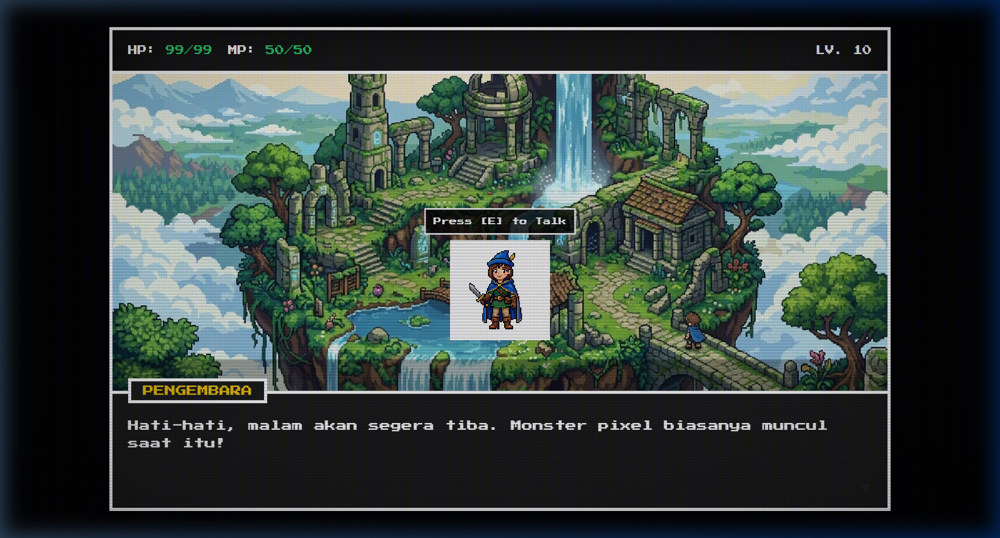

<h1 align="center">🎮 Fikri Bintang's Adventure</h1>

  

---

## 🕹️ Featured Project: Pixel Adventure

**Pixel Adventure** is a visually stunning 2D retro-style world built entirely with Vanilla Web Technologies. Immerse yourself in a nostalgic 8-bit aesthetic featuring CRT effects, typewriter dialogues, and a floating island atmosphere.

### ✨ Features
- **📺 Retro CRT Overlay**: Authentic scanlines and flickering effects.
- **💬 Dynamic Dialogue System**: Interactive NPC dialogues with typewriter animation.
- **🕹️ Character Movement**: Control your hero using arrow keys.
- **🎨 Pixel-Perfect Design**: Custom CSS-based UI components.

---

### 🎭 Profil Karakter
> **"Hai! Mau kenalan lebih jauh?"**

| Stat | Info |
| :--- | :--- |
| **Nama** | Fikri Bintang |
| **Kelas** | Mahasiswa Semester 4 |
| **Base** | Indonesia |
| **HP / MP** | 99/99 / 50/50 |

---

### 📜 Dialogue Log
* **Fikri:** "Hai! Mau kenalan lebih jauh?"
* **Fikri:** "Nama gue Fikri Bintang."
* **Fikri:** "Sekarang lagi jalanin hidup sebagai mahasiswa semester 4."
* **Fikri:** "Selamat datang di GitHub gue, siap buat explore bareng?"

---

### 🎒 Inventory (Tech Stack)

  
  
  
  
  
  
  

---

### ⚔️ Active Quests (Current Projects)
- [x] **Pixel Adventure**: Build an immersive 2D retro world.
- [ ] Naikin IPK setinggi mungkin (no pressure 😅)
- [ ] Ngebangun App Absensi (SIABSENSI) biar makin solid & kepake
- [ ] Ngulik dan eksperimen pixel art di GitHub

---

  

