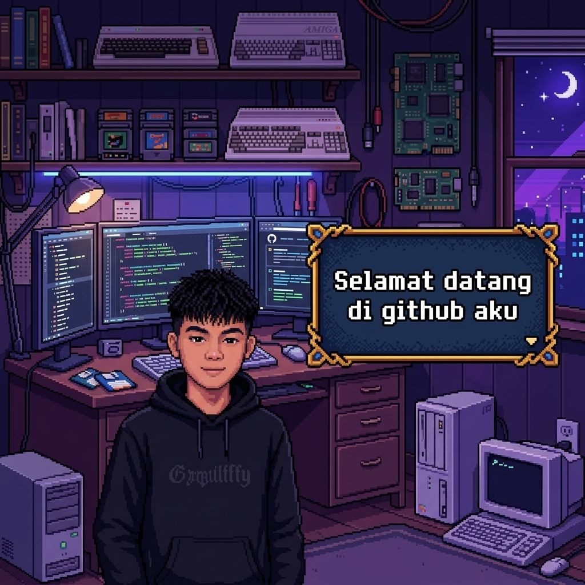

<h1 align="center"> Hello World,</h1>

  

  

---

### 🧠 About Me
*   🎓 **4th semester student** who’s still figuring things out (and enjoying the process)
*   💼 **Balancing work and study** — learning both real-world and academic stuff
*   🌍 **Based in Indonesia**
*   🎨 Really into **clean, aesthetic UI** and smooth user experience
*   🔥 Currently focused on **leveling up** as a front-end developer

---

### 🎭 Stats & Dialogue
> **"Hai! Mau kenalan lebih jauh?"**

| Key | Action |
|-----|--------|
| `←` / `→` | Move Player |
| `E` / `Space` | Next Dialogue / Skip Typing |
| `Q` | Skip to End |
| `R` | Restart Story |

| Stat | Info |
| :--- | :--- |
| **HP / MP** | 99/99 / 50/50 |
| **Level** | 10 (Semester 4) |
| **Status** | 🟢 Learning & Building |

*   **Fikri:** "Selamat datang di GitHub gue, siap buat explore bareng?"
*   **Fikri:** "Gue lebih suka belajar lewat praktek daripada teori doang."

---

### ⚡ Skills & Inventory

#### 💻 Languages
- **HTML**: udah terbiasa bikin struktur web yang rapi & scalable
- **CSS**: fokus ke layout, responsive design, dan aesthetic UI
- **JavaScript**: ngerti logic dasar sampai interactivity
- **C#**: masih tahap belajar & eksplorasi

#### 🚀 Frameworks & Tech
- **React.js**: buat bikin UI yang modular & reusable
- **Next.js**: ngerti basic SSR & struktur modern web app
- **Node.js & Express**: buat backend sederhana & API
- **Laravel**: pernah dipake buat fullstack project
- **Flutter (Dart)**: lagi eksplor mobile development

#### 🛠 Tools
- **VS Code**: daily driver
- **Figma**: design & UI planning
- **Laragon**: local development
- **Antigravity**: buat workflow Linux / environment
- **Stitch**: eksplorasi design / UI tools

---

### ⚔️ Active Quests (Projects)
- [x] **Pixel Adventure**: Build an immersive 2D retro world (Interactive!)
- [ ] **SIABSENSI**: aplikasi absensi berbasis mobile (Flutter + Supabase)
- [ ] **Personal Portfolio Website**: showcase project & skill
- [ ] **Admin Dashboard**: management dengan UI clean & modern
- [ ] **Auth System Project**: login/register system dengan backend sederhana

---

### 🎯 Goals
- 🚀 Improve front-end skills sampai level professional
- 🎨 Build UI yang bukan cuma bagus, tapi juga nyaman dipakai
- 📱 Release minimal 1 aplikasi yang bener-bener dipakai orang
- 🧠 Konsisten belajar dan upgrade skill tiap hari
- 💸 Mulai menghasilkan dari skill programming

---

### ✨ Extra
- ⚡ Suka explore design yang clean & aesthetic
- 🎧 Kadang ngoding sambil denger musik biar flow dapet
- 🧩 Lebih suka belajar lewat praktek daripada teori doang

---

  

