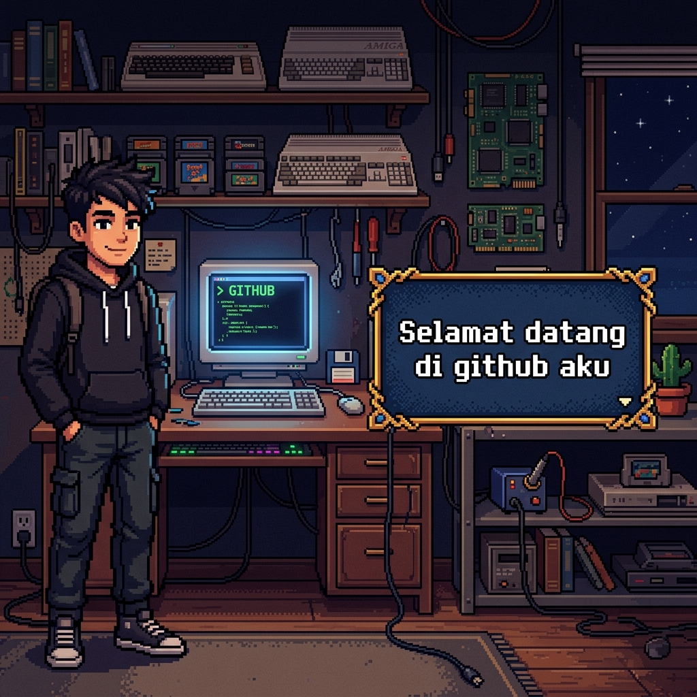

<h1 align="center">🎮 Fikri Bintang's Adventure</h1>

  

### 🎭 Profil Karakter
> **"Hai? Kamu mau mengenal ku lebih jauh?"**

| Stat | Info |
| :--- | :--- |
| **Nama** | Fikri Bintang |
| **Kelas** | Mahasiswa Semester 4 (Active Student) |
| **Base** | Indonesia |
| **HP / MP** | 99/99 / 50/50 |

---

### 📜 Dialogue Log
*   **Fikri:** "Hai? Kamu mau mengenal ku lebih jauh?"
*   **Fikri:** "Kenalkan nama aku Fikri Bintang."
*   **Fikri:** "Aku seorang mahasiswa aktif untuk sekarang di semester 4."
*   **Fikri:** "Selamat datang di GitHub aku! Mari berpetualang bersama."

---

### 🎒 Inventory (Tech Stack)

  
  
  
  

---

### ⚔️ Active Quests (Current Projects)
- [ ] Menaklukkan Semester 4 dengan IPK Sempurna
- [ ] Membangun App Absensi (SIABSENSI) yang Stabil
- [ ] Eksplorasi Dunia Pixel Art di GitHub

---

  

